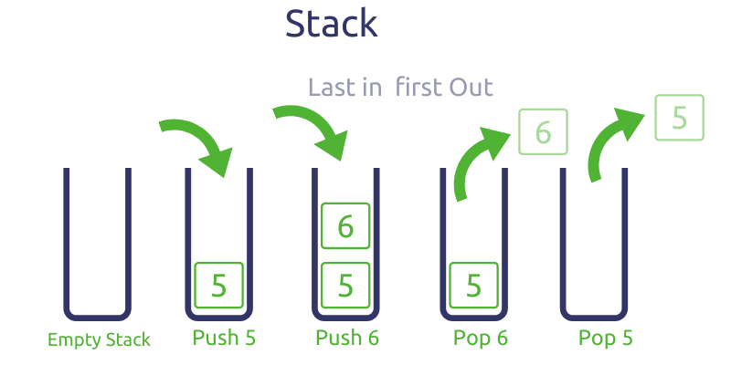

# Stacks

## Introduction

A stack is a data structure that helps us keep track of the order of operations in our programs. The order of these operations is "Last in, First out" (LIFO), meaning that the last thing you do to the stack is the first that you would undo.

The most important operations you can do to a stack are push and pop, as shown in the following image.



## Usage

There are many usages for stacks in programming. For example, when using a text editor like Microsoft Wold, we are "pushing" letters into a stack. If you press the "Backspace" key, we "pop" the last letter we typed.

Another usage is the function stack from many programming languages. The main function is often the first function to be called or "pushed" into the function stack. Main then can invoke or "push" a second function into the stack. When the second function has ended or is "poped" from the stack, we will go back to the main function. This process can be repeated with several functions stacked on top of each other, but the main function will always be the last to be completed or "poped" from the stack.

## Push

In Python, we can represent a stack using a list. To push an item to the end (or the top) of the stack, we use the append() function.

| Operation   | Description                              | Python Code            | Performance                                                |
| ----------- | ---------------------------------------- | ---------------------- | ---------------------------------------------------------- |
| push(value) | Adds a value to the back of the stack.   | stack.append(value)    | O(1) - Performance of adding to the end of a dynamic array |

```python
# Declare a stack
stack = []

# Push items in the stack
stack.append('a')
stack.append('b')
stack.append('c')

# Print stack contents
print(stack)

# This is the output: ['a', 'b', 'c']
```

Pushing values to a stack takes O(1). For this reason, stacks are a good performing data structure to use.

## Pop

To pop an item from the stack, we use the pop() function. Just as with the push operation, poping things from a stack takes O(1).

| Operation   | Description                                     | Python Code | Performance                                                  |
| ----------- | ----------------------------------------------- | ----------- | ------------------------------------------------------------ |
| pop()       | Removes one value from the back of the stack.<br /> You can save the poped value to a variable or print it to the console.  | stack.pop()<br />value = stack.pop()<br />print(stack.pop()) | O(1) - Performance of removing to the end of a dynamic array |

```python
# Pop an item from the stack
stack.pop()
# Print stack contents
print(stack)
# Output: ['a', 'b']

# Pop an item and print it to the console
print(stack.pop())
# Output: b

# Pop an item and save it to a variable
variable = stack.pop()
print(variable)
# Output: a

# Print the stack
print(stack)
# Output: []
```

## Example

Let's suppose that you want a program to check if a string is a palindrome. Even when there are other ways to solve this, you can use stacks to solve the problem.

```python
# Function to check if a string is a palindrome
def is_palindrome(str):
    # Declare a stack and save the first half of
    # the string contents
    stack = []
    for i in range(len(str) // 2):
        stack.append(str[i])
    
    # Determine the correct half of string.
    # If the string has an odd number of characters
    # you will not check the middle char in str
    correct_half = 0
    if len(str) % 2 == 0:
        correct_half = len(str) // 2
    else:
        correct_half = len(str) // 2 + 1

    # Compare the second half of the string to the
    # elements in the stack
    for i in range(correct_half, len(str)):
        if str[i] != stack.pop():
            return False
    return True

print(is_palindrome("lol"))
print(is_palindrome("racecar"))
print(is_palindrome("race car"))
print(is_palindrome("stacks are cool"))
print(is_palindrome("fun nuf"))
```

## Problem to Solve

See if you can write a palindrome checker that doesn't care about punctuation, capitalization, or the space character. Look at the test cases below.

```python
print(is_palindrome("A man, a plan, a canal: Panama.")) # True
print(is_palindrome("race car"))                        # True
print(is_palindrome("stacks are cool"))                 # False
print(is_palindrome("fun N U F111"))                    # False
print(is_palindrome("fun N U F"))                       # True
```

You can check your code with the solution here: [Solution](palindrome.py)

[Back to Welcome Page](0-welcome.md)
