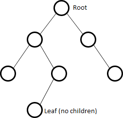
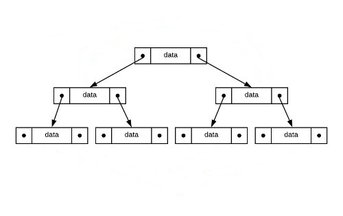
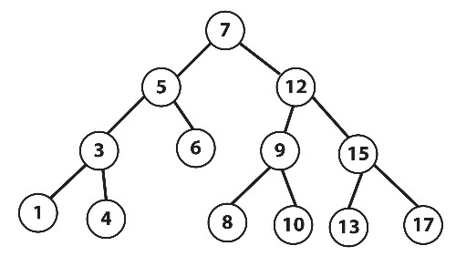
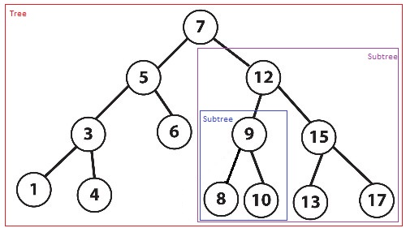

# Binary Trees

## Introduction

A binary tree is a non linear data structure, compared to arrays, linked lists, stacks and queues which are linear data structures. The following image is a graphical representation of a binary tree.



A binary tree can contain one or more nodes. The upper node is called Root. A binary tree can only have one Root from which one or two nodes connect. These nodes connected to the Root node are called Child nodes. From there, other child nodes can connect. Notice that a node can connect to only two other nodes. Lastly, the nodes that have no Child nodes are called Leafs.

Binary trees are similar to linked lists in that nodes are connected by pointers as shown in the following picture.



So each node contains data and two pointers.

## Binary Search Tree (BST)

A binary search tree (BST) is a type of binary tree that fulfills a specific ordering property. So on any subtree, the left nodes are less that the root node, which is less than all o the right nodes. This ordering property makes finding a node very fast because we have a good idea of where it would be.



## Usage

We can use BST to organize data for quick search, insertion, and deletion.

The following table shows the main operations we can perform on BST and their performance.

| Operation|Description|Performance  |
| ---------|-|-------------|
| Insert and remove |Insert or delete a value into the BST |O(log n) |
| Contains|Determine if a value is in the BST|O(log n) |
| Travers |Visit all objects from smallest to largest |O(n) |

## Recursion and BST

We can define BST as recursive data structures because any node can be consider a subtree of the main tree. The operations on a BST can be, and should be, applied recursively.



In the following tutorial, we will learn how to implement a binary serach tree. First, we will create two classes. The first class will initialize a Binary Search Tree (BST) and the second class will initialize nodes for the BST class.

## The BST (Binary Search Tree) and Node classes

```python
# Binary Serach Tree class (BTS)
class BST:

    # Node class
    # Here Node is an inner class, but this isn't necessary
    class Node:

        # Function to initialize the node object
        def __init__(self, data):
            self.data = data
            self.left = None
            self.right = None

    # Function to initialize a BTS object
    def __init__(self):
        self.root = None
```

## Inserting

This is the code needed to insert a node in the tree. If the BST is empty, then set the root equal to the new node.  Otherwise, use _insert to recursively find the location to insert.

The _insert function will look for a place to insert a node with 'data' inside of it.  The current sub-tree is represented by 'node'.  This function is intended to be called the first time by the insert function.

```python
# This function is in the BST class
def insert(self, data):
    if self.root is None:
        self.root = BST.Node(data)
    else:
        self._insert(data, self.root)  # Start at the root

# Called recursively
def _insert(self, data, node):
    if data == node.data:
        # just return
        return

    elif data < node.data:
        # The data belongs on the left side.
        if node.left is None:
            # We found an empty spot
            node.left = BST.Node(data)
        else:
            # Need to keep looking.  Call _insert
            # recursively on the left sub-tree.
            self._insert(data, node.left)

    elif data > node.data:
        # The data belongs on the right side.
        if node.right is None:
            # We found an empty spot
            node.right = BST.Node(data)
        else:
            # Need to keep looking.  Call _insert
            # recursively on the right sub-tree.
            self._insert(data, node.right)
```

Insert a value into the BST takes O(log n)

## Contains

The _contains function is intended to be called the first time by the "__contains__()" function. _contains will search for a node that contains 'data'.  The current sub-tree being search is represented by 'node'.  

```python
# Checks if data is in the BST
def __contains__(self, data):
    return self._contains(data, self.root)  # Start at the root

# This function should be called by contains()
def _contains(self, data, node):
    if data == node.data:
        return True
    elif data > node.data:
        if node.right is None:
        # The data is not in tree
            return False
        else:
            # The node at the right is now the root
            return self._contains(data, node.right)
    elif data < node.data:
        if node.left is None:
        # The data is not in tree
            return False
        else:
            # The node at the left is now the root
            return self._contains(data, node.left)
```
Determine if a value is in the tree takes O(log n)

## Traversing

Does a forward traversal (in-order traversal) through the BST.  If the node that we are given (which is the current sub-tree) exists, then we will keep traversing on the left side (thus getting the smaller numbers first), then we will  provide the data in the current node, and finally we will  traverse on the right side (thus getting the larger numbers last).

```python
# This function is called when a loop is performed:
def __iter__(self):
    yield from self._traverse_forward(self.root)  # Start at the root
        
# traverse forward
def _traverse_forward(self, node):
    if node is not None:
        yield from self._traverse_forward(node.left)
        yield node.data
        yield from self._traverse_forward(node.right)
```

Visit all objects takes O(n)

## Example

Here is a complete implementation of our tree and a short driver program.

```python
# Binary Serach Tree class (BTS)
class BST:
    # Node class
    class Node:

        # Function to initialize the node object
        def __init__(self, data):
            self.data = data
            self.left = None
            self.right = None

    # Function to initialize a BTS object
    def __init__(self):
        self.root = None

    ## Inserting
    def insert(self, data):
        if self.root is None:
            self.root = BST.Node(data)
        else:
            self._insert(data, self.root)

    def _insert(self, data, node):
        if data == node.data:
            return

        elif data < node.data:
            if node.left is None:
                node.left = BST.Node(data)
            else:
                self._insert(data, node.left)

        elif data > node.data:
            if node.right is None:
                node.right = BST.Node(data)
            else:
                self._insert(data, node.right)

    ## Contains
    def __contains__(self, data):
        return self._contains(data, self.root)

    def _contains(self, data, node):
        if data == node.data:
            return True
        elif data > node.data:
            if node.right is None:
                return False
            else:
                return self._contains(data, node.right)
        elif data < node.data:
            if node.left is None:
                return False
            else:
                return self._contains(data, node.left)

    ## Traversing
    def __iter__(self):
        yield from self._traverse_forward(self.root)
            
    def _traverse_forward(self, node):
        if node is not None:
            yield from self._traverse_forward(node.left)
            yield node.data
            yield from self._traverse_forward(node.right)

# Declare a BST
tree = BST()

# Insert a few values
tree.insert(5)
tree.insert(3)
tree.insert(7)
tree.insert(10)
tree.insert(9)

# Determine if 'values' are in tree
print(3 in tree)    # True
print(11 in tree)   # False
print(7 in tree)    # True

# Traverse the tree printing the nodes
for x in tree:
    print(x)        # 3, 5, 7, 9, 10
```
Source: Trees (https://byui-cse.github.io/cse212-course/lesson09/09-prepare.html#1.4)

## Problem to solve

Using the BST above, see if you can write a method to check the height of the tree or a subtree. Note that an empty tree will have a height of 0 and a tree with one item (root) will have a height of 1.

Use this starting code...

```python
# These functions should be in the BST class
# If the tree is empty, then return 0.  Otherwise, call 
# _get_height on the root which will recursively determine the 
# height of the tree.
def get_height(self):
    if self.root is None:
        return 0
    else:
        return self._get_height(self.root)

# Determine the height of the BST.  The height of a sub-tree 
# (represented by 'node') is 1 plus the height of either the 
# left sub-tree or the right sub-tree (whichever one is bigger).
# This function intended to be called the first time by 
# get_height.
def _get_height(self, node):
    
```

You can check your code with the solution here: [Solution](bst.py)

[Back to Welcome Page](0-welcome.md)